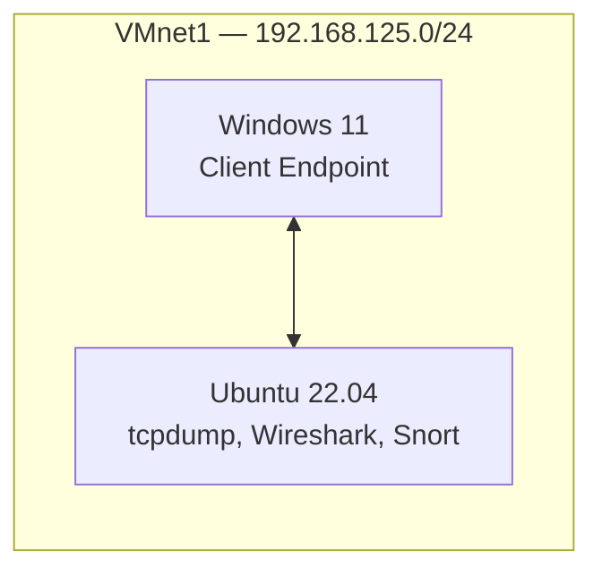

# TCM SOC Prep
Preparing for the TCM PSAA cert exam

## SOC 101 Lab Environment

Two-VM lab matching TCM Security's SOC-101 course setup, built on VMware Workstation Pro 17
### Overview

| VM             | Role                                                  | Network | Subnet             |
| -------------- | -------------------------------------------------------- | ------- | -------------------- |
| Windows 11     | Client endpoint — target for phishing/endpoint exercises | VMnet1  | 192.168.125.0/24    |
| Ubuntu 22.04   | Analysis host — tcpdump, Wireshark, Snort (IDS)           | VMnet1  | 192.168.125.0/24    |

### Networking

Both VMs sit on the same custom host-only network (**VMnet1**, 192.168.125.0/24) so traffic between them is visible to Ubuntu's monitoring tools — this is the VMware equivalent of VirtualBox's "Internal Network" used in the course.

### Architecture Diagram

### Tools Installed

- **Ubuntu VM:** tcpdump, Wireshark, Snort (network IDS/IPS)
- **Windows VM:** target endpoint for phishing analysis and endpoint security modules

### Design Notes

- Built on **VMware Workstation Pro 17** rather than VirtualBox networking concepts transfer directly; only the Virtual Network Editor's UI differs from VirtualBox's network manager.
- Both VMs share one internal network so Snort/tcpdump on Ubuntu can observe traffic to/from the Windows endpoint.
